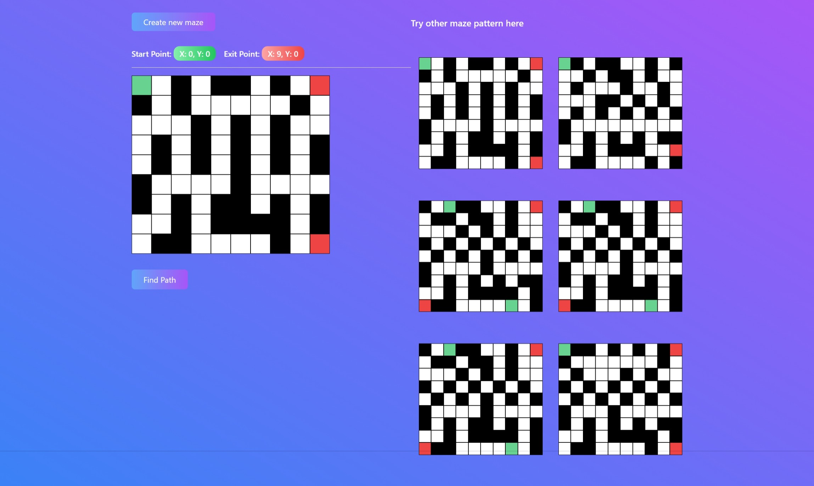

# 🌀 **Maze Path Finding** with **Go** and **ReactJS** 🌀

Navigate the intricate world of mazes with our **Maze Path Finding** application, where cutting-edge technologies blend seamlessly to provide an interactive and visually appealing experience.

## 🚀 **Demo**

### Explore Diverse Maze Patterns

Choose from a variety of pre-designed maze patterns to challenge your **problem-solving skills**. Each maze offers a unique layout, and your goal is to find the optimal path from the starting point to the exit.

### Create Your Own Maze Pattern

In addition to using the provided patterns, you can also create your own maze pattern by specifying the maze's shape, entering values for **X and Y** for the length and width of the maze you want to create.

Unleash your creativity by crafting personalized mazes. Define the shape, dimensions, and intricate details of your maze. Add a touch of uniqueness by placing a green **Start Point**, a red **Exit Point**, and black **Walls**. The power is in your hands to design mazes that push the boundaries of complexity.

## 🔄 **Algorithm**

### **Depth-First Search (DFS)**

The algorithm used for pathfinding in this project is **Depth-First Search (DFS)**. DFS explores a maze by moving as far as possible along each branch before backtracking. It is a recursive algorithm that systematically explores all paths of the maze until it finds the exit.

## 🛠️ **Tech Stack**

-   **Go and Gin:**

    -   **Gin** is a lightweight and flexible web framework for **Go** that enables the development of RESTful APIs. **Clean Architecture** is employed in the backend design to achieve modularity, maintainability, and testability. This architectural approach divides the application into layers such as entities, use cases, and infrastructure, ensuring that business logic remains independent of external frameworks and libraries.

-   **ReactJs and TypeScript:**

    -   The frontend is developed using **ReactJs**, a popular JavaScript library for building user interfaces. **TypeScript** is utilized to add static typing to the JavaScript code, improving code quality and developer experience. React allows for the creation of dynamic and responsive UI components, enhancing the user experience in maze exploration.

-   **Tailwind CSS:**
    -   **Tailwind CSS** is employed for styling the user interface. It is a utility-first CSS framework that allows for rapid development and easy customization. Tailwind CSS classes are used to apply styles and create a visually appealing and responsive design for the maze pathfinding application.
